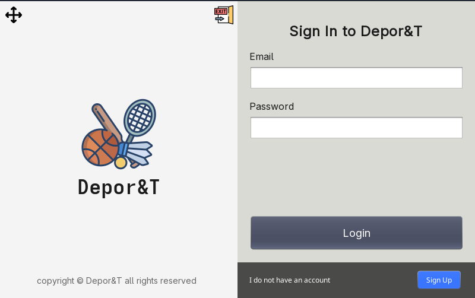
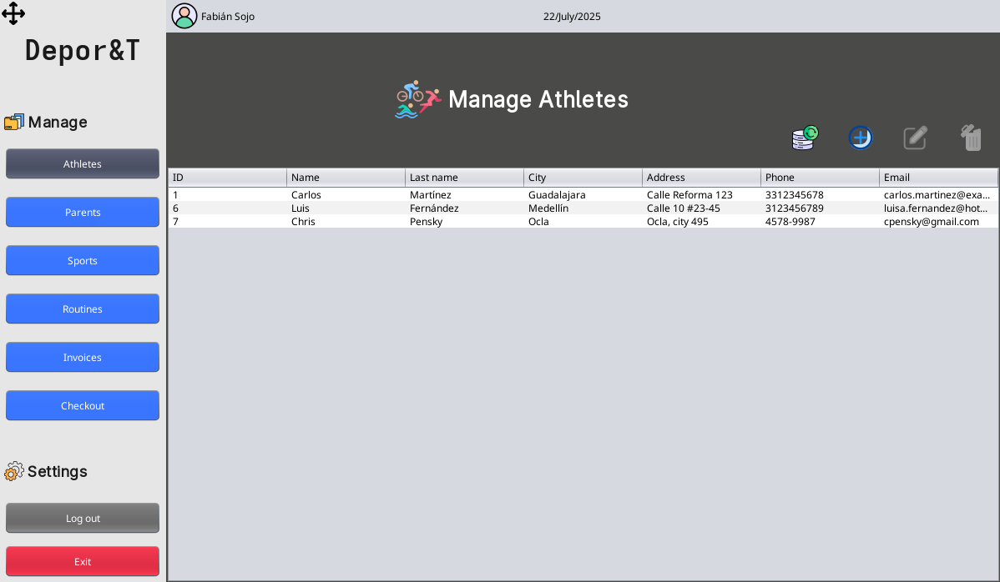

# Depor&T — Sports Training Center Management System

A comprehensive Java desktop application to manage athletes, routines, invoices, parents, sports, and users for a sports training center. Built with modular OOP architecture, persistent storage in SQL, and client-server support via sockets.

---

## 📸 Preview





---

## Features

- **Athlete Management:** Register, update, and list athletes with associated routines and invoices.
- **Parent & User Management:** Manage guardians and app users with role-based access.
- **Routine & Sport Tracking:** Link sports and custom routines to athletes.
- **Invoice Management:** Generate, store, and update invoices.
- **Secure Password Handling:** User authentication and secure data access.
- **Client-Server:** Socket-based communication for multi-user scenarios.
- **DAO Layer:** Modular, maintainable data access architecture.
- **NetBeans GUI Forms:** Visual UI editing and rapid prototyping.

---

## 🧾 Checkout Module

The **Checkout** module manages the process of generating and handling invoices (bills) for athletes and their activities at the training center.

**Features:**
- Lists all pending invoices for athletes.
- Allows marking invoices as paid.
- Handles the registration of payments and updates athlete status accordingly.
- Provides both a **client** (user) and **server** (admin/operator) UI for invoice processing.

**Key files & structure:**
```
src/
└── view/
    └── checkout/
        ├── CheckoutPanel.java           # Main checkout UI panel
        ├── CheckoutPanel.form           # NetBeans UI form for checkout
        ├── CheckoutServerPanel.java     # Server/operator side panel
        └── CheckoutServerPanel.form     # NetBeans UI form for server checkout
```

**Integration:**
- The `CheckoutPanel` is used in the main user interface for regular users to process payments.
- The `CheckoutServerPanel` is for operators/admins to manage all checkouts from a central server view.
- The logic interacts with the `InvoiceController`, `InvoiceDAO`, and uses the `ConnectionDB` for persistence.
- Designed for easy extension—add more payment methods, validation, or export options as needed.

**Example usage:**
- To open the checkout panel, navigate through the main menu or select the "Checkout" option from the dashboard.
- All unpaid invoices are listed; users or operators can select and process payment directly.
- Payments are instantly reflected in the database and athlete/account status is updated.

---

---

## 🗂️ Project Structure

```
src/
├── app/                # Application entry point (Main.java)
├── controller/         # Business logic and coordination
├── dao/                # Data Access Objects & implementations (by module)
├── db/                 # DB connection utilities (ConnectionDB.java)
├── images/             # UI icons and images
├── model/              # Entity classes (Athlete, Parent, etc.)
├── resources/          # SQL schema and resources (scheme.sql)
├── socket/             # Socket client (future: server?)
├── util/               # Utilities/helpers
├── view/               # Swing UI forms, panels & windows
└── ...                 # Other folders (login, invoice, etc.)
```

**Key files:**
- `src/app/Main.java` — Main launcher class
- `src/resources/scheme.sql` — Database schema (PostgreSQL/MySQL compatible)
- `src/db/ConnectionDB.java` — Configure DB connection here
- `src/view/MainView.java` — Main application window (Swing)
- `src/socket/SocketClient.java` — Client socket logic

---

## 🚀 Getting Started

### 1. **Clone the Repository**

```sh
git clone https://github.com/Sojo506/centro_capacitacion_deportivo.git
cd centro_capacitacion_deportivo
```

### 2. **Configure the Database**

- Create a new database (PostgreSQL or MySQL recommended).
- Import the schema:

```sh
# Example for MySQL
mysql -u your_user -p your_database < src/resources/scheme.sql
```

- Edit `src/db/ConnectionDB.java` with your database credentials.

### 3. **Build the Project**

- Open the project with NetBeans (recommended for GUI forms).
- Or use Ant:

```sh
ant clean
ant build
```

### 4. **Run the Application**

- Via NetBeans: Right-click `Main.java` → Run
- Via terminal (if using Ant, see `/dist` folder):

```sh
java -jar dist/CentroCapacitacionDeportivo.jar
```

### 5. **Login Information**

Default users can be found in the database after schema import. You may need to manually insert an admin/user or check initial values in `scheme.sql`.

---

## 🧩 Dependencies

- Java 8+ (JDK)
- SQL DBMS (MySQL/PostgreSQL)
- NetBeans IDE (for GUI editing)
- Java Mysql Connector

*No external libraries required. Pure Java SE.*

---

## 💻 Architecture Overview

- **MVC-inspired**: Separation between `model/`, `controller/`, and `view/`
- **DAO Layer**: For every entity, there's a DAO and an implementation class (e.g., `AthleteDAO`, `AthleteDAOImpl`)
- **Client-Server (Sockets)**: Basic infrastructure for socket communication (`SocketClient.java`). Server side pending/under development.
- **Extensible**: Easily add new entities, routines, or views.

---

## ⚙️ Folder Details

| Folder          | Description                                                      |
|-----------------|------------------------------------------------------------------|
| `app/`          | Entry point, launches the main window.                           |
| `controller/`   | Handles business logic, orchestrates DB and UI.                  |
| `dao/`          | Data access interfaces & implementations (per module/entity).    |
| `db/`           | Manages DB connections/settings.                                 |
| `model/`        | POJO classes for domain entities.                                |
| `resources/`    | SQL schema, static data.                                         |
| `view/`         | Java Swing UI components, built with NetBeans Design Builder.    |
| `images/`       | Application icons, logos, and UI graphics.                       |
| `socket/`       | Networking (client socket).                                      |
| `util/`         | Utility/helper classes.                                          |

---

## 🛠️ Customization

- **Add More Users/Roles:** Use SQL or add new UI features.
- **Change Images/UI:** Replace/add PNGs in `src/images/`.
- **Extend Client-Server:** Expand socket logic in `src/socket/`.

---

## 🙋 FAQ

**Q:** _How do I reset the database?_  
**A:** Drop and re-import `scheme.sql` into your DB.

**Q:** _Can I use another DBMS?_  
**A:** Yes! Just ensure JDBC compatibility and update `ConnectionDB.java`.

**Q:** _Can I customize the UI?_  
**A:** Fully! All GUIs are NetBeans `.form` + `.java` pairs. Use NetBeans Design Builder for WYSIWYG editing.

---

## 👥 Credits

Developed by Sojo506.

---

## 📄 License

This project is for educational purposes.  
For contributions or commercial use, contact me.
